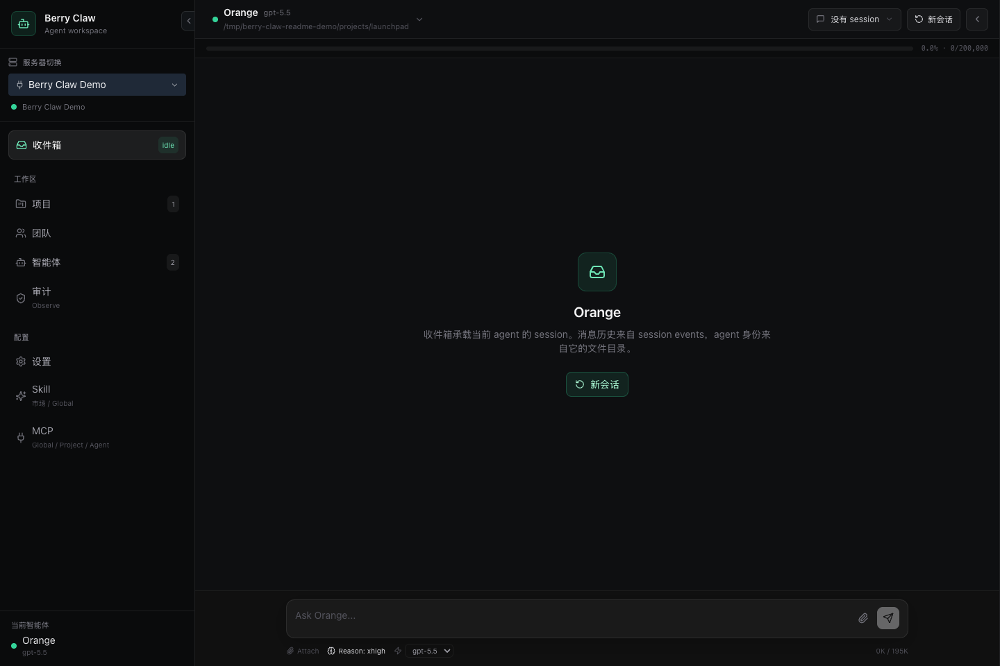
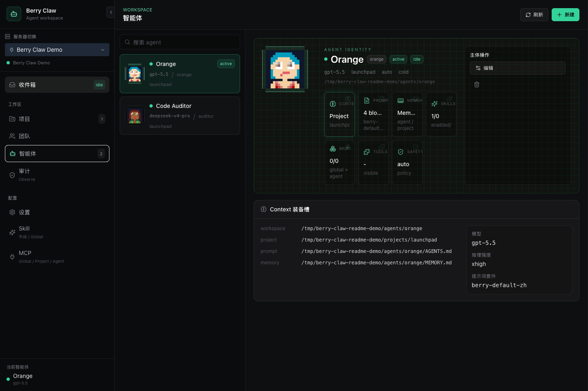

# Berry Claw

Local-first agent workspace built on [Berry Agent SDK](https://github.com/Xiamu-ssr/berry-agent-sdk).

Berry Claw is the product shell around the SDK: server instance management, a shared React client, multi-agent chat, projects, teams, skills, MCP, safety settings, prompt packs, and observability.





## Install

```bash
npm install -g @berry-agent/claw-server@alpha
```

Requires Node.js 20 or newer.

## Quick Start

```bash
berry-claw start
```

Open [http://localhost:3210](http://localhost:3210).

Berry Claw uses instance keys for local client authentication. To connect another browser or desktop shell:

```bash
berry-claw key show
```

Paste the private key into the connect screen. The client stores known instances locally and will reconnect on later visits.

## CLI

| Command | Purpose |
| --- | --- |
| `berry-claw start` | Start the server and serve the built Web UI |
| `berry-claw key show` | Print the current server identity and private client key |
| `berry-claw key reset --force` | Rotate the instance key and revoke old clients |
| `berry-claw doctor` | Check local runtime readiness |
| `berry-claw install browser` | Install the browser runtime used by browser tools |
| `berry-claw config get <scope> [key]` | Inspect provider, model, tier, or agent config |
| `berry-claw config set <scope> <key> <value>` | Update config from CLI |

## Product Surface

- Inbox: event-first session UI backed by SDK `events.jsonl`, with provider context coming from `messages.json`.
- Agents: per-agent identity, project binding, prompt pack, model, memory, skills, MCP, tools, and safety override.
- Projects: project-level context and shared `.berry` data.
- Teams: leader/teammate roster, worklist, and team message surfaces.
- Skills: global skill market and per-agent enablement.
- MCP: global, project, and agent MCP layers.
- Settings: backend instances, providers, models, tiers, credentials, and global safety.
- Audit: observe data from SDK/server usage, cost, guard, and inference events.

## Published Packages

| Package | Purpose |
| --- | --- |
| `@berry-agent/claw-server` | Berry Claw server, `berry-claw` CLI, and bundled Web UI |
| `@berry-agent/claw-contracts` | Shared REST/WebSocket/fact schemas |

Private workspace packages:

| Package | Purpose |
| --- | --- |
| `@berry-agent/claw-client` | Shared React/Vite client used by Web, mobile, and desktop shells |
| `@berry-agent/claw-mobile` | Capacitor shell for Android/iOS packaging |
| `@berry-agent/claw-desktop` | Electron desktop shell for macOS/Windows/Linux packaging |

The client build is bundled into `@berry-agent/claw-server` during publish.

## Data Layout

Default home:

```text
~/.berry-claw/
├── config.json
├── instance.key
├── agents/
│   └── <agent-id>/
│       ├── AGENTS.md
│       ├── MEMORY.md
│       └── sessions/
│           └── <session-id>/
│               ├── messages.json
│               └── events.jsonl
├── prompt-packs/
├── skills/
└── observe.db
```

Override with:

```bash
BERRY_CLAW_HOME=/path/to/home berry-claw start
```

## Development

```bash
npm install
npm run dev
```

Development ports:

- server: [http://localhost:3210](http://localhost:3210)
- client: [http://127.0.0.1:3211](http://127.0.0.1:3211)

Build and test:

```bash
npm run build
npm test
```

Publish dry-run:

```bash
npm pack --dry-run --workspace=@berry-agent/claw-contracts
npm pack --dry-run --workspace=@berry-agent/claw-server
```

## Platform Builds

The UI source lives only once, in `packages/client`.

```text
packages/client   React/Vite client
packages/mobile   Capacitor Android/iOS shell
packages/desktop  Electron desktop shell
packages/server   Node server + CLI + bundled Web UI
```

Android setup:

```bash
npm -w @berry-agent/claw-mobile run add:android
npm -w @berry-agent/claw-mobile run apk:debug
```

Desktop build:

```bash
npm -w @berry-agent/claw-desktop run build
```

GitHub releases should attach every built platform artifact available for that
version: npm server/contracts, desktop installers, and mobile APK/AAB files.
The `Release` GitHub Actions workflow does this automatically for `v*` tags.

## SDK Boundary

Berry Claw should not duplicate SDK-owned runtime logic. The product owns:

- UI state and platform shell state
- server instance auth
- provider/model configuration UX
- global/project/agent setting surfaces
- product facts and WebSocket transport

The SDK owns:

- agent lifecycle
- provider messages and compaction
- event log append/read format
- tools, MCP adapters, skills, prompt packs, memory, and safety primitives

## Status

Alpha. The project is intentionally optimized for fast iteration over backward compatibility.
